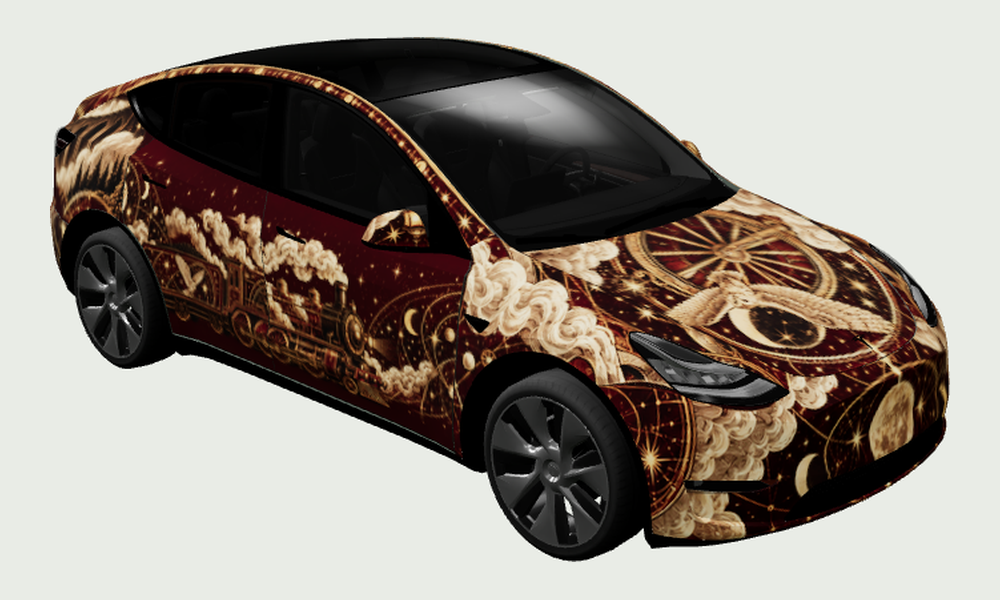
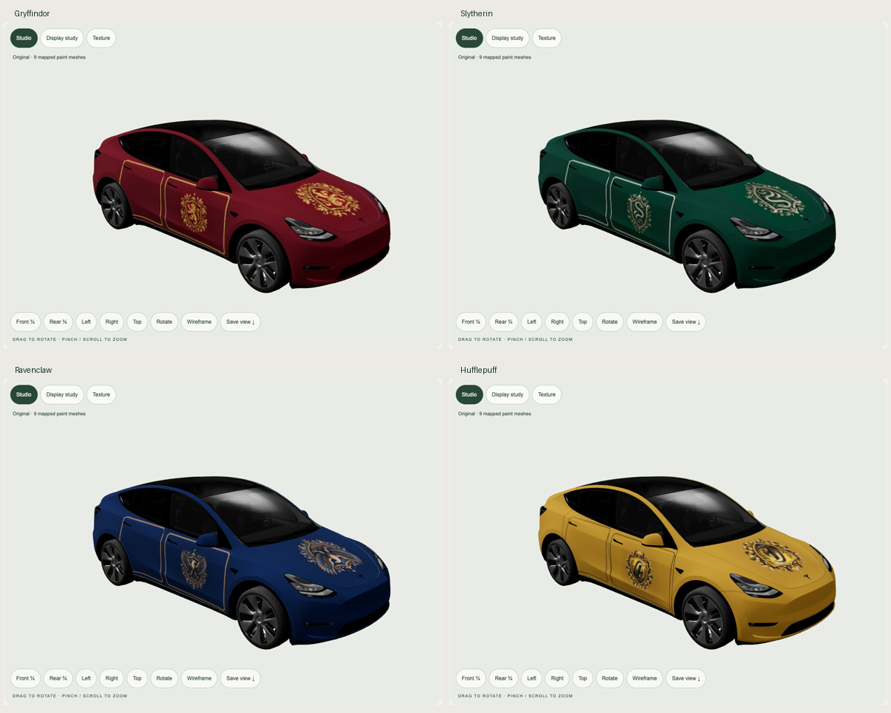
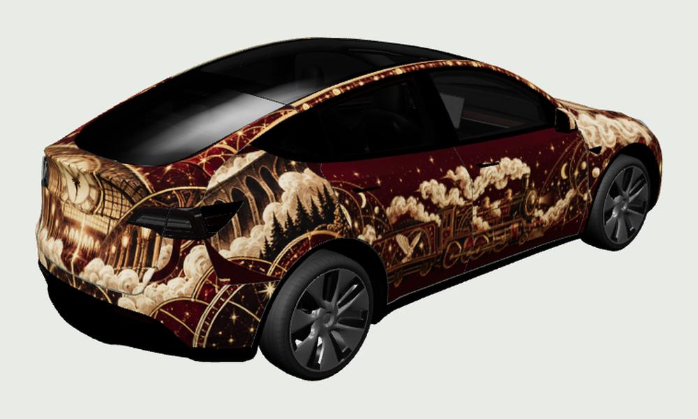
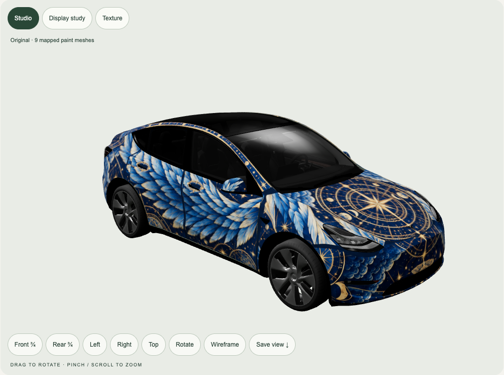

# Tesla Wrap Lab

**Describe a wrap to Codex. Preview it on your Model Y. Take the PNG to Tesla Paint Shop.**

A local 3D viewer and installable Codex skill for image-generated digital wraps. It includes Hogwarts Express and four Hogwarts house-inspired examples, all five official Model Y template families, model-specific PNG export, and a screenshot-driven imagegen refinement workflow.



| A collection of generated examples | Responsive phone view |
|---|---|
|  |  |

These are **digital vehicle-display skins**, not physical vinyl production files. The viewer maps real PNGs onto a render mesh; it does not change body geometry, glass or wheels. It is an independent project, not affiliated with Tesla or the brands referenced in fan artwork.

[Download source or skill ZIP](https://github.com/jayfarei/tesla-wrap-lab/releases/latest) · [Browse exported PNGs](public/wraps) · [See all five models](docs/screenshots/model-matrix.png)

## Quick start

Requires Node.js 20+, Python 3.10+, Git and a modern WebGL browser. Initial setup downloads dependencies and about a few tens of MB of vehicle assets; the viewer itself then works locally without network services.

```sh
git clone https://github.com/jayfarei/tesla-wrap-lab.git
cd tesla-wrap-lab
npm ci
npm run setup:assets
npm run dev -- --port 5178
```

Open the URL Vite prints, normally **http://127.0.0.1:5178**. Select your exact vehicle, choose a design, rotate the car, and download the matching PNG. **Save view** captures the current car for review. **Texture** shows the actual exported artwork. **Display study** is an illustrative screen layout, not Tesla software.

The gallery and PNG downloads need no image-generation key. To create new artwork with Codex, use a Codex environment with the built-in imagegen tool. The skill does not add imagegen access to a client that lacks it.

## Install the Codex skill

```sh
npm run install:skill
```

This copies `skills/tesla-wrap-lab` to `$CODEX_HOME/skills/tesla-wrap-lab` (default `~/.codex/skills/tesla-wrap-lab`) and links it to this checkout. Start a new Codex session if needed. Updating an existing installation requires `python3 scripts/install-skill.py --replace`.

Then ask:

> Use $tesla-wrap-lab to make a Ravenclaw-inspired wrap for my original Model Y Long Range. Generate detailed artwork, check it on the car, refine the fit and give me the Tesla-ready PNG.

Or:

> Use $tesla-wrap-lab to create a dark botanical wrap for my 2025 Model Y Premium. Keep the design subtle, show me the real mapped preview and explain how to install it.

The skill resolves the checkout, installs local Python dependencies, starts the viewer, uses imagegen, fits the correct template, captures mapped views, feeds corrections back into imagegen and validates the output. If only the skill folder is installed, its bootstrap script can clone this public repository into its own `.runtime/`. It asks for vehicle details when they are missing; it never silently treats Long Range as Model Y L.

[Skill instructions](skills/tesla-wrap-lab/SKILL.md) · [Imagegen pipeline](docs/PIPELINE.md) · [Agent entry point](AGENTS.md)

## Supported Model Y templates

| Viewer selection | Template id | Scope |
|---|---|---|
| Original / pre-2025 | `modely` | Original body, including Long Range; Gemini-wheel preview |
| 2025+ Standard | `modely-2025-base` | Standard body/trim template |
| 2025+ Premium | `modely-2025-premium` | Premium / Juniper template |
| 2025+ Performance | `modely-2025-performance` | Separate Performance template |
| Model Y L | `modely-l` | Long-wheelbase Y L, **not** original Long Range |

This covers Tesla's five published Model Y template families as verified on 2026-10-01. Exact wheels, trim details and registration-year transitions can differ. Each family has its own mesh and template; its PNGs are not interchangeable with other families.

## Body-aware Ravenclaw experiment

A richer design compares multi-view concept-first, template-first and a hybrid with mesh-measured ornament placement. Open **http://127.0.0.1:5178/studies/ravenclaw/index.html** after starting the viewer, or read the [experiment and limits](public/studies/ravenclaw/README.md). The preferred original-body export is `raven-celestial-v3`. [Feature-aware workflow](docs/FEATURE-AWARE.md).



## Included examples

- **Hogwarts Express:** burgundy, brass and owl heraldry. The original-body edition has the richer carriage/map atlas; newer-body editions use separately fitted emblem layouts.
- **Gryffindor:** crimson and gold lion engraving.
- **Slytherin:** emerald and silver serpent engraving.
- **Ravenclaw:** blue and bronze eagle engraving.
- **Hufflepuff:** gold and charcoal badger engraving.
- **F1 silver** and **Alpine Expedition:** earlier studies for the original Model Y only.

The first five designs have separate exports for all five Model Y families: **25 PNGs**, plus the two earlier original-body studies. Four additional original-body exports preserve the richer Ravenclaw experiment and its iterations. Generated source artwork is in `examples/artwork/`; reproducible placement is in `scripts/build-examples.py`. Catalogue entries distinguish preview review from in-car verification. These are unofficial fan designs; none is claimed to have been verified inside a Tesla.

## Install a PNG on your Tesla

1. Select the exact Model Y family and download its PNG. Keep its generated filename.
2. **Tesla app v4.59.0+:** open **Creations → Wrap → Upload**, then select the PNG. **Or USB:** place it in a folder named **Wraps** at the root of a compatible drive.
3. **In the car:** open **Toybox → Paint Shop → Wraps**, select it, and inspect all sides.

Files must be PNG, square 512–1024px, and no larger than 1 MB. Use alphanumeric characters, underscores, dashes and spaces in filenames (up to 30 characters). This tool exports 1024px and uses a conservative 1,000,000-byte ceiling. Tesla allows up to 10 app wraps and 10 USB wraps.

USB formats: exFAT, FAT32/MS-DOS FAT, ext3 or ext4; not NTFS. No map or firmware updates should be on the drive. Do not erase a drive to install a wrap. If the menu is missing, check current app/vehicle support. [Detailed instructions and troubleshooting](docs/TESLA-INSTALL.md) · [Tesla's official instructions](https://github.com/teslamotors/custom-wraps).

## Create and export manually

```sh
python3 -m venv .venv
.venv/bin/python -m pip install -r requirements.txt
.venv/bin/python scripts/wrap.py models
.venv/bin/python scripts/wrap.py export \
  --model modely --source path/to/generated-flat-atlas.png \
  --name Botanical_v1.png --base '#193a2b' \
  --id botanical-v1 --title 'Botanical v1'
```

On Windows use `.venv\Scripts\python.exe`. The exporter masks against the selected template, preserves full colour when it fits the size limit, validates and registers the PNG. Rectangular atlases must be composed onto a square canvas first. **It does not automatically solve panel placement or transfer one body's atlas to another.** Inspect and refine it in the viewer. The PNG and provenance sidecar are written under `public/wraps/<model-id>/`.

## Development and checks

```sh
npm test
npx playwright install chromium
npm run test:browser
npm run review -- --model modely --wrap ravenclaw
.venv/bin/python -m unittest discover -s tests -p 'test_*.py'
.venv/bin/python scripts/wrap.py validate-catalog
npm run build
```

[Architecture](docs/ARCHITECTURE.md) · [Validation evidence](docs/VALIDATION.md) · [Imagegen prompts](examples/PROMPTS.md)

`npm run package` creates a portable source ZIP and standalone skill ZIP from Git-tracked files. The source bundle intentionally excludes downloaded meshes/templates, dependencies, private reference photos and runtime files. `npm run setup:assets` retrieves pinned assets on the receiving machine. `npm run build` creates a local static viewer; **do not publish that build without reviewing its bundled third-party asset rights**.

## Provenance and limitations

Software is MIT-licensed; third-party models/templates and generated fan artwork are separate. [THIRD_PARTY.md](THIRD_PARTY.md) explains asset sources and what is excluded from the code licence. Mesh availability is an external dependency, and setup stops if pinned content changes. You can inspect the source URL/hash for every downloaded asset in `asset-manifest.json`.

The preview uses matte paint and approximate lighting. A PNG cannot control Tesla's shaders or add a roof rack, raised spare wheel or other geometry. A valid PNG and a good local render are useful evidence, but the final check is on the vehicle.
